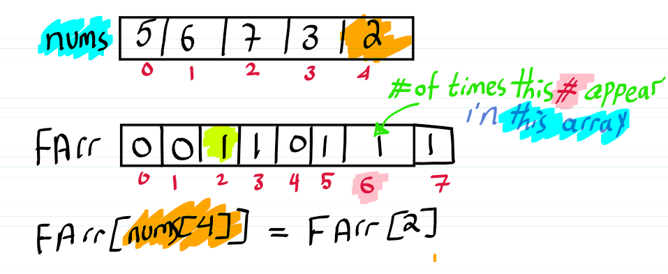

>This repository contains solutions to coding problems I solve during my last three months of military service. The focus is on mastering fundamental topics such as arrays, hashing, stacks, queues, etc., while exploring key techniques like two pointers, sliding window, prefix sums, and more. Additionally, I delve into algorithms like sorting and searching, emphasizing not just implementation but also understanding **how** and **why** specific techniques or approaches are effective or suboptimal in different scenarios.

# Arrays and hashing

The first section, "Arrays and hashing," covers several key problems and solutions related to array manipulation and hash-based data structures. Here's a summary of the main topics:

- **Contains Duplicates:** This problem involves finding duplicate elements in an array. Solutions include brute force, sorting, and using a set data structure.
- **Valid Anagram:** Determining if two strings are anagrams of each other. Approaches include sorting and using hash maps.
- **Two Sum:** Finding two numbers in an array that add up to a target sum. An efficient solution uses a hash map.
- **Group Anagrams:** Grouping strings that are anagrams of each other. A solution using hash maps and frequency arrays is discussed.
- **Top K Frequent Elements:** Finding the k most frequent elements in an array. Solutions include using frequency arrays, hash maps, and bucket sort.
- **Product of Array Except Self:** Calculating the product of all elements except the current one. An efficient solution using prefix and postfix products is presented.
- **Longest Consecutive Sequence:** Finding the length of the longest consecutive elements sequence. Solutions include using sets and sorting.

These problems cover various techniques such as using hash-based data structures, sorting approaches to solve array and string manipulation problems efficiently.

## 1.1 [Contains Duplicates](https://leetcode.com/problems/contains-duplicate/) [Easy]

Given an integer array `nums`, return `true` if any value appears **at least twice** in the array, and return `false` if every element is distinct.

**Example:**

**Input:** nums = [1,2,3,1] , **Output:** true, **Explanation:** The element 1 occurs at the indices 0 and 3.

**Input:** nums = [1,2,3,4], **Output:** false, **Explanation:** All elements are distinct.

**Constraints:**

- `1 <= nums.length <= 10^5`
- `-10^9 <= nums[i] <= 10^9`

### Bruteforce solution

This the simplest way to think of it just here we can iterate on each element and compare it with all elements after it until the end of the array and when we find two elements equal it will return false if not it will return true 

```python
class Solution:
    def containsDuplicate(self, nums: List[int]) -> bool:
        
        for i in range(len(nums)):
	        for j=i+1 in range(len(nums)):
		        if (nums[i] == nums[j]):
			        return False
		return True
```

but this this bad solution bcs the Time complexity = O(n^2), Space complexity = O(1), what if we can make it more faster by using something like sort by the way, sort will be a helpful friend in this section, keep it in your mind.

### Using Sorting

Try to think out of the box, here the main problem is if an element is dublicate we make the second loop to iterate until find the it’s twin, what if we can make something make any dublicate come after each other and we just will iterate the loop with one loop and compare each element with it’s neighbor, we need something make this [1,2,3,2,1,5] like that [1,1,2,2,3,5], absolutely YES it’s a SORT! 

This way is more faster if will take about Time Complexity = O(nlog(n)) and Space Complexity =O(1) the time complexity i mentioned here it’s the cost of sorting the array (merge sort) in practice this the best algorithm to sort array, regardless using count sort -read about it, it’s AMAZING!-

```python
class Solution:
    def containsDuplicate(self, nums: List[int]) -> bool:
        nums.sort() #this will return sorted version of nums
        for i in range(len(nums)):
            # the importance of this line to avoid reach i+1 in the end
		    # where nums[i+1] = nums[len(nums)+1] an exist position in our array
            if (i != len(nums)-1):
                if(nums[i] == nums[i+1]):
                    return True
        return False
```

### Using Frequency array (FArr)

it’s look like the solution can be better than this above solutions, what’s your opinion after looking to space complexity and get help from it, in above solutions Space complexity = O(1) we can change it a little bit  to enhance our time complexity, let’s think in this problem with more smart solution -has cons i will discuss letter-, the word “dublicate” means the element appear more than one time with help of this what if i have something can count the no. of times the element appear and store them in something like array and iterate over this elements  and check if any exist element have more than 1 in it’s value, let’s illustrate this:

looks logically!, but when we using FArr we must take care about constrains that mentioned in our problem statement:

1. if the values of elements range will be more than 10^6 it’s a bad idea to use the FArr and this what’s happen in our problem here the the range of elements values will be 10^9
2. if the range of elements values will be negative this holds to make your FArr’s size multiple by 2 bcs the indices of array start with 0 and not has negative indices, so we dublicate FArr’s size and rearrange values by adding the size to it (e.g. -10 ≤ values ≤ 10 then FArr[20] and 
arr[index] = -5 and FArr[index + 10] this will shift elements in positive part of FArr)  



To this reasons i don’t use FArr here BUT i mentioned to it just for learning and it’s another helpful friend

### Using Set

This solution illustrate the powerful of learning Datastructers with the help of sets we can solve this in time complexity = O(n), from the math background sets it’s something the main prosperity of it it’s not allow to dublicate elements from this we start our solution we can do:

1. insert elements in set once and check the size of set and size of provided list if equal then 
not exist duplicates but if size of set less than size of list this mean there exist duplicates
2. we can insert each element and check if element exist before in set or not if exist then
return true if not insert and it and keep doing this until the list ends

what make the second choice more powerful that you exactly stop iterating the list when you find the element that dublicate rather than the first choice of first choice that make you iterate all list here the difference not big but in this article, i try to document why this not that.

```python
class Solution:
    def containsDuplicate(self, nums: List[int]) -> bool:
        elements = set()
        for i in nums:
            if i in elements:
                return True
            elements.add(i)
        return False
        
# another approach
#def solution(nums: list[int]) -> bool:
#    return (len(nums) != len(set(nums)))
```

## 1.2 [Valid Anagram](https://leetcode.com/problems/valid-anagram/) [Easy]

Given two strings `s` and `t`, return `true` if `t` is an anagram of `s`, and false otherwise.

**Example 1: Input:** s = "anagram", t = "nagaram",  **Output:** true

**Example 2: Input:** s = "rat", t = "car", **Output:** false

**Constraints:**

- `1 <= s.length, t.length <= 5 * 10^4`
- `s` and `t` consist of lowercase English letters.

### Using Sorting

From the problem definition the anagram mean this words has the same characters holds them have the same alphaptic order, so if we can sort the characters of 1st string and 2nd string, iterate on both, check if them have the same order then we can find the solution with 
Time Complexity = O(nlog(n)) and Space Complexity = O(1)

it’s not need to mention if they don’t have the same length holds they not anagrams

```python
class Solution:
    def isAnagram(self, s: str, t: str) -> bool:
        s = sorted(s)
        t = sorted(t)
        if len(s) != len(t): 
            return False
        for i in range(len(s)):
            if s[i] != t[i]:
                return False
        return True
```

### Using Hashmap (Dictionaries)

First you need to learn about [Hashmap](https://www.geeksforgeeks.org/hash-map-in-python/), after that we can brief that Hashmap it’s a generalization of  arrays in array the indices will be integer consecutive values but here the index can be every thing but with some constrains: 1. The key must be immutable, 2. keys must be pre-initialized, so to solve this problem I will mentioned to it’s solutions will writing the code and this solutions mentioned in [Hashmap](https://www.youtube.com/watch?v=RcZsTI5h0kg&pp=ygUHaGFzaG1hcA%3D%3D) video, and the main advantage of using hashmap it’s allows search in O(1)!

Go back to our solution, from our understanding of hashmap we need to define what is the index and what’s the value here we can say the index will be the character and the value will be how many times it’s appear and then check for each index in string1 and string2 what it’s value if equal for all then it’s anagram, again index here not the 0,.,.,n-1 it’s the character you choice to be, I know it’s maybe difficult to understand hashmap from this small brief, so try to learn this concept it’s very useful and good friend in your journey.

This will take Time complexity = O(n) and Space complexity = O(n)

```python
class Solution:
    def isAnagram(self, s: str, t: str) -> bool:
        
        if(len(s) != len(t)):
            return False
        
        stringS, stringT = {} , {}
        for i in range(len(s)):
		        #to slove the problem of pre-initialized keys
		        #if the key not exist "get" will make it's value 0
		        #we can use anthor solution by using collection defaultdict -read about it-
		        #<read about it again, Karim>
            stringS[s[i]] = stringS.get(s[i], 0) + 1
            stringT[t[i]] = stringT.get(t[i], 0) + 1
        
				#here it's iterate of all index and it's value in both dic
        return stringS == stringT
```

### Using Collection

First this solution maybe not work in interview bcs it’s depend on the powerful of language, Here python provide a comprehensive libraries to dell with strings and other problems one of them lib called [counter](https://www.youtube.com/watch?v=yrV__XKaFn8&pp=ygURY291bnRlciBpbiBweXRob24%3D) it take an object like string and make a hashmap with index will be character and value will be the no. of times it’s appear in string and the Time complexity = O(n)  and Space Complexity O(n) BUT this is more faster and shorter than our above code and it can use to solve another problems try to read more about it.

```python
class Solution:
    def isAnagram(self, s: str, t: str) -> bool:
        return Counter(s) == Counter(t)
```

## 1.3 [Two sum](https://leetcode.com/problems/two-sum/description/) [Easy]

Given an array of integers `nums` and an integer `target`, return *indices of the two numbers such that they add up to `target`*,You may assume that each input would have ***exactly* one solution**, and you may not use the *same* element twice, You can return the answer in any order.

**Example 1:** Input: nums = [2,7,11,15], target = 9 , Output: [0,1], Because nums[0] + nums[1] == 9, we return [0, 1].

We can solve this by **Bruteforce** solution but will be time complexity = O(n^2) and we need 
to enhance it, what if we use set this will lost the index of value and not be help 
It’s look sort doesn’t be helpful for the previous reason of missing the index and lost it 
-This is my opinion, maybe there is someone can solve this problem with those ideas, but me not-

Through our journal we meet friend called hashmap it can help here? first hashmap can track index of element and also can’t loss the value additionally search will be in O(1), It’s seem we find something more interesting here!

### Using Hashmap

First let benefit from this assumption "each input would have **exactly one solution**" this mean each element has one element and only one to get the target, so we can create a hashmap and store each (value: index) and here the key will be the value of cell to make it easier if we want to check if element in hashmap or not and if not store it and if exist at this point return the solution, e.g.
nums = [2,7,11,15], target = 9 Then we can get dff = target - arr[i] and check if the dff in hashmap this mean we find the two integers that get the target, here in our example:
diff = 9 - 2 = 7 is 7 in hashmap(empty at this point) no then add 2 to hashmap
diff = 9 - 7 = 2 is 2 in hashmap(has 2 just from previous step) yes then return the value of 2 “index of 2” and return the index of list at this point.

another example: nums = [3,2,4], target = 6 , hashmap={}
diff = 6 - 3 = 3 is in hashmap no then add key=nums[i] and value=i , hashmap = { {3,0} }
diff = 6 - 2 = 4 is in hashmap no then add key=nums[i] and value=i, hashmap ={ {3,0}, {2,1} }
diff = 6 - 4 = 2 is in hashmap yew then return the [hashmap[diff], i] = [hashmap[2], 2] = [1,2]

This approach it’s Time Complexity = O(n), Space Complexity = O(n)

```python
from collections import defaultdict
class Solution:
    def twoSum(self, nums: List[int], target: int) -> List[int]:
        mapa = {}
        for index, value in enumerate(nums):
            if(target - value) in mapa:
                return [ mapa[(target - value)], index]
            mapa[value] = index
        return
```

## **1.4 [Group Anagrams](https://leetcode.com/problems/group-anagrams/description/) [Medium]**

Given an array of strings `strs`, group the anagrams together. You can return the answer in 
**any order**.

**Example 1: 
Input:** strs = ["eat","tea","tan","ate","nat","bat"], 
**Output:** [["bat"],["nat","tan"],["ate","eat","tea"]]

### Using Hashmap and FArr

Now the problems look more interesting and more complicated and in above problems we solve problem about anagrams and discuss idea behind it, now we need to group all anagrams together as usual first question when using hashmap is what’s the key? that will be used to group things that 
i look for and what is the point where the objects intersect, here the kay come from our understanding of anagram itself, we can call two strings are anagram if both have the same sequence of characters(e.g. tan and nat both have {1a, 1t, 1n}).

From this point i can use small trick FArr i mentioned it in previous problem, here the FArr’s size will be maximum at 26 -the number of alphabtic characters- bcs any word will form from this characters here we can use FArr to be our key, but there is a problem here array’s index is integer not characters and we know if FArr[5] = 3 this mean value 5 appear 3 times in original something that i find FArr to it, and 5 here is index and must be integral +value, how we can exist from this trip?!

The idea is using mapping, by map each character to integral value (e.g. a→ 0 , b→1, … , z→25) this will be something like this (e.g. “ebae” ⇒ FArr = [1,1,0,0,2,…,0]), so every string i can describe using it’s FArr, from this we can get a conclusion that if you interesting in characteristics among object not object itself we can thinking in using FArr as part of our solution.

Now we can define hashmap like this hashmap = { { [FArr]: [elements that has this pattern] } }  (e.g. hashmap = { { [1,1,0,0,2]:[”aeeb”, “eaeb”, “baee”] } } ⇒ key= [1,1,0,0,2], value=[”aeeb”, “eaeb”, “baee”])

```python
class Solution:
    def groupAnagrams(self, strs: List[str]) -> List[List[str]]:
        result = defaultdict(list)

        for string in strs:
            pattern = [0] * 26
            for char in string:
                pattern[ord(char) - ord('a')] += 1

            result[tuple(pattern)].append(string)
        return list(result.values())
```

## 1.5 [Top K Frequent Elements](https://leetcode.com/problems/top-k-frequent-elements/description/) [Medium]

Given an integer array `nums` and an integer `k`, return *the* `k` *most frequent elements*. You may return the answer in **any order**.

**Example 1: Input**: nums = [1,1,1,2,2,3], k = 2, **Output:** [1,2]

**Constraints:**

- `1 <= nums.length <= 1^5`
- `-1^4 <= nums[i] <= 1^4`
- `k` is in the range `[1, the number of unique elements in the array]`.
- It is **guaranteed** that the answer is **unique**.

### Using Frequency array (FArr) and sorting

Let’s think of it without our beautiful friend (hashmap) here we can think in this problem using FArr because the values of array not very large and can use FArr here and it’s not the best solution bcs it takes Time complexity = O(nlog(n)), Space Complexity = O(n) and a lot of O(n) through the code, BUT we build different solutions to learn more and learn when and why we choice this not that 
let’s jump to explain how to use this solution.

First will go through each element and count it’s values through whole array (the concept of FArr), and then make a list and store every element and it’s index in a list as pair and sort this list depending on the values of each element then return element’s index from the end of list bcs we need the elements the has most frequent appears, right! 

But we must make consideration about two things, first the values of given array can be negative, so we can solve this problem by using mapping and map each value to the new value in array and then subtract this value when we want to retrieve the original value and to do that we must declare the size of FArr be (2* actual size) and add  (1→10) number to avoid the Q is the range of values is exclusive or inclusive -to avoid death by one-, the second thing to note we must store the # of appears as first element of pairs that we store bcs sort() function store depending on first element.

```python
class Solution:
    def topKFrequent(self, nums: List[int], k: int) -> List[int]:
		    # if U multiply 2 here we will get index out of limit error
			  # bcs we will add i to this vlaue access to freq so, 
			  # we must multiply 2 when declare array.
        mappingValue =  (10**4) + 2
        freq = [0] * (2*mappingValue)
        for i in nums:
            freq[i + mappingValue] += 1      
        temp = []
        for i in range(len(freq)):
            if freq[i] != 0:
		            # here we store # of appears as first element to sort depending on it
		            # and i here represent the value that has the # of appears
                temp.append([freq[i], i])
        temp.sort()
        ans = []
        while len(ans) < k:
		        # the [1] here refer to second element in pair
		        # e.g. if we have (5, 4) => (the index here 0, the index here 1)
		        # and here we focus on second element that represent the value
            ans.append(temp.pop()[1] - mappingValue)
        return ans
```

### Using Hashmap and sorting

The above solution looks to be good let’s enhance it by using smart ds you will meet hashmap, 
by the way just using hashmap will increase our code performance 4 times, with the same above idea but  the access to hashmap more faster then access to FArr in practice -read about it- 
Thanks hashmap!

```python
class Solution:
    def topKFrequent(self, nums: List[int], k: int) -> List[int]:
        hashmap = defaultdict(int)
        for i in nums:
            hashmap[i] += 1       
        # this part just to sort the elements bcs i can't sort it using hashmap itself 
        temp = []
        for key, appears in hashmap.items():
            temp.append([appears, key]) 
        temp.sort()
        res = []
        while len(res) < k:
            res.append(temp.pop()[1])        
        return res
```

### Using Bucket Sort

Let’s discuss the problem of above solutions, the main problem is “sorting” in each solution,
we must sort the result from hashmap or FArr what if we can replace this idea with smarter one 
in this problem our hero is the frequency of element and we success to find it but our problem was after we finding the frequencies we need to sort them to find most frequency elements, what if we find a solution that make the sorting done through our actual solution and not need to make it in separate step!

The idea here come from the name of the sorting technique, here we make real bucket like that 
in our supermarkets, from beginning will put your buckets in increasing order and make one bucket for all fruits that has the same price rather than put it in different places and this make it sorted by default and not need to move each bucket to right position.

So rather than focus on element itself and make it the index in FArr why not make 
the # of appears be the index and the value will be the key that appear this times 
let’s name this CArr, let’s take an example: (e.g. nums=[1,1,1,2,2,3,3,4] ⇒ CArr = [0,[4],[2, 3],[1]] 
this mean [4] appears i=1 and [2,3] appears i=2) got it! let’s illustrate it, keep in your mind we just flip the concept of FArr. 


From this we will got Time complexity = O(n) bcs most # can appear is the length of give list
(e.g. nums=[1,1,1,1,1] the most # of appears = size = 5 ⇒ CArr = [0,0,0,0,0,[1]]), and we iterate over this by maximum(n+1) time to find top k frequent elements

Bad news come here the last interloop make this solution bad because if all elements appear ones we iterate n*n times, I discuss it bcs it seems can be helpful friend in our journey, and if you can handle this part you will get faster code!
```python
class Solution:
    def topKFrequent(self, nums: List[int], k: int) -> List[int]:
        hashmap = defaultdict(int)
        for num in nums:
            hashmap[num] += 1
        # to avoid index out of range error i declare buckets 
        # +1 here bcs we start count with 0 and it can be appears
        # size not (size - 1)
        buckets = [[] for i in range(len(nums) +1)]
        for frute, price in hashmap.items():
            buckets[price].append(frute)       
        ans = []
        # here we iterate from back <- t o get largest element
        for price in range(len(buckets) - 1, 0, -1):
	        # to skip empty buckets
	        if buckets[price]:
	            for frute in buckets[price]:
	                ans.append(frute)
	                if len(ans) == k:
	                    return ans
```

## 1.6 [Product of Array Except Self](https://leetcode.com/problems/product-of-array-except-self/description/) [Medium]

Given an integer array `nums`, return *an array* `answer` *such that* `answer[i]` *is equal to the product of all the elements of* `nums` *except* `nums[i]`.
- The product of any prefix or suffix of `nums` is **guaranteed** to fit in a **32-bit** integer.
- You must write an algorithm that runs in `O(n)` time and without using the division operation.

**Example 1: Input**: nums = [1,2,3,4], **Output**: [24,12,8,6]

**Constraints:**

- `2 <= nums.length <= 10^5`
- `-30 <= nums[i] <= 30`
- The product of any prefix or suffix of `nums` is **guaranteed** to fit in a **32-bit** integer.

### Using Bruteforce

The hardest part of this problem is the restrictions and if we eliminate them we can solutions very simple like bruteforce that take Time complexity = O(n^2), just you use interloop and when i=j don’t compute this element in your product value and store the final product in result[i]

```python
class Solution:
    def productExceptSelf(self, nums: List[int]) -> List[int]:       
        size = len(nums)
        ans = [1] * size
        for i in range(size):
            for j in range(size):
                if i != j:
                    ans[i] *= nums[j]        
        return ans
```

Very straightforward solution but this will given a “**Time Limit Exceeded”,** so we need another solution, with more cleaver idea!

### Using Prefix & Postfix

What is the main problem here? we need idea such that make us don’t need interloop! 
what if we consider each element split our list into two arrays prefix and postfix of it and to get
the product at this element we need to product the prefix and postfix array of it, let’s illustrate:


Thus, we can assume that we have two arrays one to compute the prefix and another to postfix 
and at each value we we compute the prefix and postfix of this value (inclusive the element), 
to make it much easier let’s divide our solution to three main step:
1. How to find prefix array?
2. How to find postfix array?
3. How to use them to find our result? (peace of cake)

**1. How to find prefix array?**

First, we need to know what exactly this mean if you solve problem like prefix sum this will be very easy task  just at each position you need to compute the product of all elements until this element


But here we have another problem what is the value will put in the 1st position?, very easy 
we can assume that there is position prefix[-1]=1 and multiply it by num[0] and store it in prefix[0], 
this always hold prefix[0]=nums[0], bcs prefix[0] = prefix[-1] * nums[0] = 1*nums[0] = nums[0],
Thus from beginning in code we will put prefix[0] = nums[0] and start iterate from 1.

**2. How to find postfix array?**
with the same idea but at this case we will start nums from right to left, bcs we here try to find postfix of each element (assume size = 4 and indexing will start with 0, i will use same notation in array 0->3, size=3 -just in this example-)

But here we have another problem what is the value will put in the last position?, very easy 
we can assume that there is position postfix[4]=1 and multiply it by num[3] and store it in postfix[3], this always hold postfix[3]=nums[3], bcs postfix[3] = postfix[4] * nums[3] = 1*nums[3] = nums[3], Thus from beginning in code we will put postfix[3] = nums[3] and start iterate from (3 - 1= 2).
**3. How to use them to find our result?**
Now let’s combine our previous solutions, to understand the image below you must now something when we compute prefix[i] or postfix[i] we used the value of element num[i] also, so we can’t use prefix[i] or postfix[i], But we take the product of all array elements before it and all after this the main thing you must to understand, got it!
Thus, result[i] = prefix[i-1] * postfix[i+1] and not prefix[i] * postfix[i], bcs i used num[i] itself to compute this value.

The last problem will happen here, result[0] = prefix[-1] * postfix[1], and from previous discussion we solved this problem and the same will happen here result[0] = postfix[1]
and result[3] = prefix[2] * postfix[4] = prefix[2] * 1 = prefix (general result[size-1] = prefix[size -2] )

This code will take Time complexity = O(n) and Space complexity = O(n), seems space complexity can be better!
```python
class Solution:
    def productExceptSelf(self, nums: List[int]) -> List[int]:  
        # Don't forget indixing in array start from 0, ok!
        size = len(nums)
        # code to compute prefix array
        prefix = [1] * size
        prefix[0] = nums[0]
        for i in range(1, size):
            prefix[i] = prefix[i-1] * nums[i]        
        # code to compute postfix array
        postfix = [1] * size
        postfix[size-1] = nums[size-1]
        # if size = 4 and postfix[3] already taken above this line
        # thus, we start with postfix[2] and stop postfix[0]
        # bcs -1 exclusive here
        for i in range(size - 2, -1, -1):
            postfix[i] = postfix[i+1] * nums[i]       
        result = [0] * size
        result[0] = postfix[1]
        result[size-1] = prefix[size-2]				
				# last element here will be i = size - 2
				# holds last element will compute
				# result[size -2] = prefix[size-3] * postfix[size-1]
				# e.g. result[2] = prefix[1] * postfix[3], right!
        for i in range(1, size-1):
            result[i] = prefix[i-1] * postfix[i+1]       
        return result
```

### Using Prefix & Postfix (Enhanced version)

The enhanced here on space complexity and challenge here to make it O(1) and just use the one array that will be return as answer, how to do this stuff!

let’s discuss main point here, are we actually benefit from postfix and prefix arrays? it can do 
this stuff without this extra space, YES!

First iterate from left to right, we will iterate through array and have extra weapon “pre”, 
this value i will use to store in it the product of all elements before the element i stop on it, and update it at each step and will inserted just when we back step from the element that used, 
here the order of this statements VERY IMPORTANT, bcs we store the pre in answer and then product it by current element and so on


second let’s iterate from right to left, with “post” weapon at this time and do the same thing 
but with small changes

This will enhance our space complexity to be O(1), good one!
```python
class Solution:
    def productExceptSelf(self, nums: List[int]) -> List[int]:
        size = len(nums)
        ans = [1] * size
        pre = 1
        for i in range(size):
            ans[i] = pre
            pre *= nums[i]       
        post = 1
        for i in range(size-1, -1, -1):
            ans[i] *= post
            post *= nums[i]       
        return ans
```

## **1.7 [Longest Consecutive Sequence](https://leetcode.com/problems/longest-consecutive-sequence/description/): [Medium]**

Given an unsorted array of integers `nums`, return *the length of the longest consecutive elements sequence,* You must write an algorithm that runs in `O(n)` time.

**Example 1: Input**: nums = [100,4,200,1,3,2], **Output:** 4, **Explanation:** The longest consecutive elements sequence is[1, 2, 3, 4]. Therefore its length is 4.

**Constraints:**

- `0 <= nums.length <= 1^5`
- `10^9 <= nums[i] <= 10^9`

### Using Bruteforce

This solution take Time complexity = O(n^2), Space complexity = O(n), let’s discuss how to build the solution, to make access to elements more faster we will using set, bcs we don’t care  about index of element we just focus on element itself and need to reach it as fast as possible we can use   Set for O(1) average time complexity lookups, right!

Next, we will take every element of a set and find it’s streak, let’s take an example to describe it 
(e.g. nums = [100,4,200,1,3,2], first streak = 0 we take 100 and ask our self is 100+0=100 in our set if yes then streak = 1 ⇒ still at 100 ask our self again 100+1=101 in our set if yes increase it by 1 )
if not stop here and store it’s streak in variable called longest and so on until reach to 1 longest=1
take 1 ask 1+0 = 1 in our set if yes  streak = 1 ⇒ 1+1 = 2 in our set if yes streak = 2 ⇒ 1+2 = 3 
in our set if yes streak = 3 ⇒ 1+3 = 4 in our set if yes streak = 4 ⇒ 1+4 = 5 in our set, NO!
stop here and longest will be 4 and move to next element until finish nums.

Here the code will give you “**Time Limit Exceeded”** ,So we need solution to make it better and 
more faster with smarter idea!

```python
class Solution:
    def longestConsecutive(self, nums: List[int]) -> int:       
        elements = set(nums)
        streak = 0
        longest = 0
        for element in elements:
            streak = 0
            while (element +streak) in elements:
                streak += 1
            longest = max(longest, streak)
        return longest       
```

### Using Sets

The main idea here, what is the special property of sequence? it’s beginning, the start of sequence
if we can find idea that tell us this element can be start of a sequence, the big amount of work done let’s take above example and sort it, maybe we can find something!

nums = [1,2,3,4,100,200], what make 1 be a start of sequence is no number before it, right!, and 100 the same there is no 99 in this list what make 100 start of sequence with length = 1 and 200 also
this the idea, now let’s ask another question Are we interesting in index of element or element itself? the element itself so why not using set and copy all elements of nums in it, and search for every element if it has a the number before it in nums or not if not this can be start of sequence so keep search about elements greater than it by 1, and only stop if the sequence terminate.

This bad at the end, bcs there exist interloop, can be consider Time complexity = O(n^2), bad!

```python
class Solution:
    def longestConsecutive(self, nums: List[int]) -> int:        
        elements = set(nums)
        longest = 0
        for num in nums:
            if (num - 1) not in elements:
                length = 1
                while (num + length) in elements:
                    length += 1
                longest = max(length, longest)       
        return longest
```

### Using Sort

This solution will be better a lot from above solutions and again here we choice to using sort bcs we not care about index, if we sort nums we can get solution in O(nlog(n)) time, 
nums=[100,1,200,2,4,3] ⇒ nums = [1,2,3,4,100,200] and check if the next one equal to current then we need to skip it bcs it can occur duplicates we just need to increment the length if the next element is grater than current by 1, simple as that!    

```python
class Solution:
    def longestConsecutive(self, nums: List[int]) -> int:
        if not len(nums):
            return 0
        nums.sort()
        length = 0
        longest = 0
        for i in range(len(nums)-1):
            if nums[i] == nums[i+1]:
                continue
            if (nums[i+1] - nums[i] == 1):
                length += 1
            else:
                length = 0
            longest = max(longest, length)
        # we add one here, bcs the last iteration that tell us sequence end 
        # not complete and the length reset to 0, so we need to add this one at the end
        return (longest +1)
```

### Using Hashmap and sorting

```python
class Solution:
    def longestConsecutive(self, nums: List[int]) -> int:
        if not len(nums):
            return 0
        hashmap = {}
        nums.sort()
        for num in nums:
            hashmap[num] = hashmap.get(num-1, 0) + 1
        return(max(list(hashmap.values())))
```

