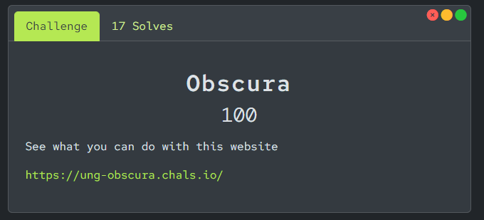
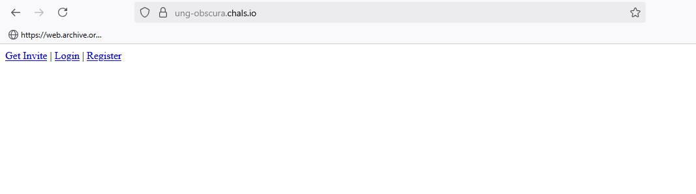
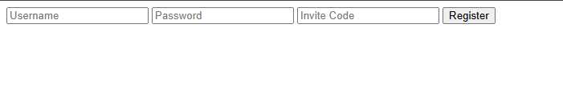
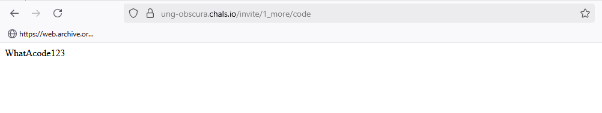
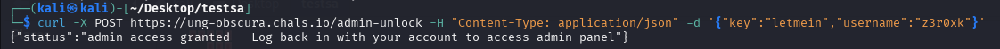
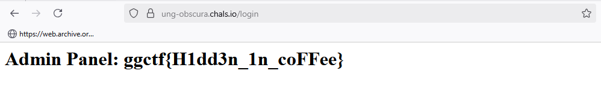

Welcome to my walkthrough of the Goldrush Gauntlet CTF challenges. In this writeup, I'll be sharing my journey through various security challenges and the techniques used to solve them.

> **Key Takeaway**: Always examine JavaScript files in web challenges - they often contain crucial information or hints that lead to the solution.

## Web Challenge: Hidden Treasures



### Initial Reconnaissance

Upon visiting the challenge URL, we're presented with a simple login page:



### The Hunt Begins

1. First, I explored the site's directories and found a registration option. However, it required an invite code:



2. After examining the page source, I discovered an interesting JavaScript file named `inviteapi.min.js`. Its contents were obfuscated:

```javascript
eval(function(p,a,c,k,e,d){e=function(c){return c};if(!''.replace(/^/,String)){
    while(c--)d[c]=k[c]||c;k=[function(e){return d[e]}];e=function(){return'\w+'};c=1;}
    while(c--)if(k[c])p=p.replace(new RegExp('\b'+e(c)+'\b','g'),k[c]);return p;}
('2 0=3(){4\"Use base64 to decode this: L2ludml0ZS8xX21vcmUvY29kZQ==\"}',5,5,
'generateInvite|function|var|function|return'.split('|'),0,{}));
```

3. The file contained a base64 encoded string. Decoding it revealed a path: `/invite/1_more/code`

4. Visiting this path provided me with the invite code:



### Digging Deeper

5. After creating an account and logging in, I continued examining the source code and found another JavaScript file: `adminapi.min.js`:

```javascript
eval(function(p,a,c,k,e,d){e=function(c){return c};if(!''.replace(/^/,String)){
    while(c--)d[c]=k[c]||c;k=[function(e){return d[e]}];e=function(){return'\w+'};c=1;}
    while(c--)if(k[c])p=p.replace(new RegExp('\b'+e(c)+'\b','g'),k[c]);return p;}
('2 0=3(){4\"Fraq CBFG gb /nqzva-haybpx jvgu obql: {{ xrl: \\\"yrgzrva\\\", hfreanzr: \\\"<lbhe_hfreanzr>\\\" }}\"}',5,5,
'elevate|function|var|function|return'.split('|'),0,{}));
```

6. After decoding, the message read:
```
"Send POST to /admin-unlock with body: {{ key: \"letmein\", username: \"<your_username>\" }}"
```

### Striking Gold

7. I sent the POST request using curl:



8. Finally, logging back in with my credentials (z3r0xk:123) revealed the flag:



### Key Lessons
- Always inspect JavaScript files in the source code
- Pay attention to obfuscated code - it often contains valuable information
- Use tools like base64 decoder for encoded strings
- Remember to check for API endpoints mentioned in source code

This challenge demonstrated the importance of thorough source code review and understanding of common web security concepts like authentication bypass techniques.

---
*Note: This writeup follows responsible disclosure guidelines. All vulnerabilities discussed were part of the CTF environment.* 